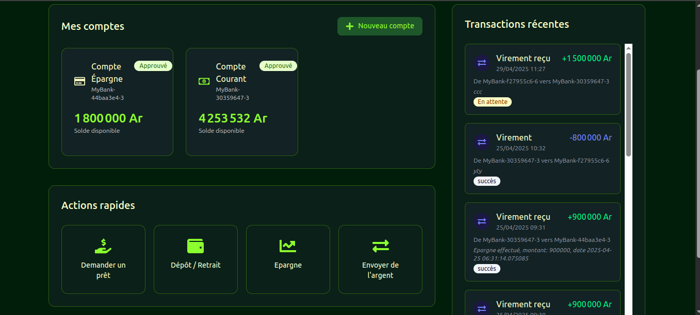

# MyBank - Système Bancaire en Ligne

MyBank est une application bancaire complète qui permet aux clients de gérer leurs comptes, effectuer des transactions,
demander des prêts et plus encore. L'application est construite avec une architecture moderne, utilisant Django pour le
backend et React pour le frontend.

## Fonctionnalités

### Pour les clients

- **Gestion de compte** - Création et gestion de comptes bancaires
- **Transactions** - Virements entre comptes, dépôts et retraits
- **Prêts** - Demande et suivi de prêts bancaires
- **Mobile Money** - Intégration avec les services M'vola et Orange Money (simulation: pas l'api Mobile Money)
- **Historique des transactions** - Suivi détaillé de toutes les opérations

### Pour les administrateurs

- **Tableau de bord** - Vue d'ensemble des activités bancaires
- **Gestion des utilisateurs** - Administration des comptes clients
- **Approbation des comptes** - Validation des nouvelles demandes de compte
- **Gestion des prêts** - Approbation ou rejet des demandes de prêt
- **Validation des transactions** - Contrôle des virements importants

## Technologies utilisées

### Backend

- **Django** - Framework web Python robuste et sécurisé
- **Django REST Framework** - API RESTful pour la communication avec le frontend
- **JWT Authentication** - Authentification sécurisée avec tokens
- **PostgreSQL** - Base de données relationnelle performante

### Frontend

- **React 19** - Bibliothèque JavaScript pour construire l'interface utilisateur
- **TypeScript** - Typage statique pour un code plus robuste
- **Vite** - Outil de build ultra-rapide pour le développement moderne
- **React Router** - Navigation fluide entre les pages
- **Tailwind CSS** - Framework CSS utilitaire pour un design responsive
- **React Toastify** - Notifications élégantes pour l'utilisateur

### Sécurité

- **CORS** - Protection contre les requêtes cross-origin non autorisées
- **HTTP-only Cookies** - Stockage sécurisé des tokens de rafraîchissement
- **Validation des données** - Contrôle strict des entrées utilisateur
- **Permissions granulaires** - Contrôle d'accès basé sur les rôles (Admin, Client, Employé)

## Installation et démarrage (elle n'est pas encore deployée)

### Prérequis

- Python 3.10+
- Node.js 18+
- PostgreSQL

### Backend

```bash
# Créer un environnement virtuel
python -m venv .venv
source .venv/bin/activate  # Sur Windows: .venv\Scripts\activate

# Installer les dépendances
cd backend
pip install -r requirements.txt

# Configurer la base de données
python manage.py migrate

# Démarrer le serveur
python manage.py runserver 8001
```

### Frontend

```bash
# Installer les dépendances
cd frontend
npm install

# Démarrer le serveur de développement
npm run dev
```

## Architecture

L'application suit une architecture client-serveur moderne:

- **API RESTful** - Communication standardisée entre frontend et backend
- **Séparation des préoccupations** - Backend pour la logique métier, frontend pour l'UI
- **Authentification JWT** - Tokens d'accès de courte durée avec rafraîchissement sécurisé
- **Modèle de données relationnel** - Structure optimisée pour les opérations bancaires

## Captures d'écran




